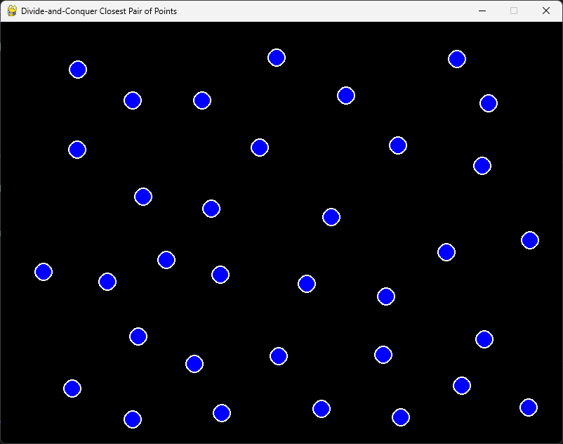
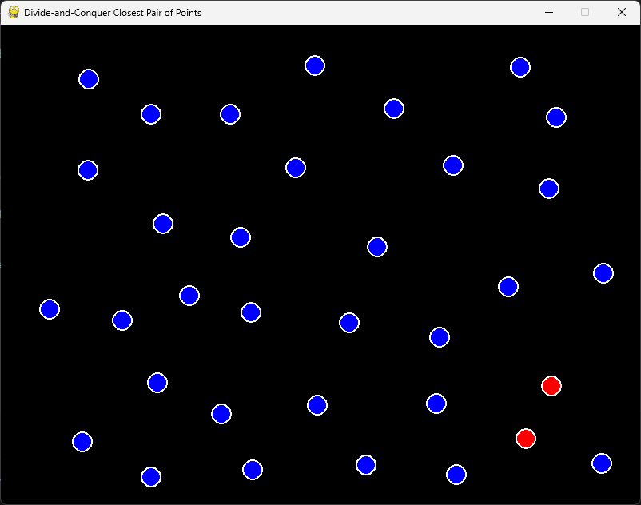

# Closest Pair of Points

**Número da Lista**: 23  
**Conteúdo da Disciplina**: Grafos 2  

## Alunos
|Matrícula | Aluno |
| -- | -- |
| 20/0073249  |  Pedro Vitor Augusto de Jesus |

## Sobre

Este algoritmo é um aplicativo de interface gráfica que permite a criação e visualização do Par de Pontos Mais Próximos em um conjunto de pontos no plano cartesiano, utilizando o algoritmo de Divisão e Conquista. A interface é construída utilizando a biblioteca `pygame` e permite a interação do usuário para adicionar pontos ao plano e, em seguida, calcular e destacar o par de pontos mais próximos.

A ideia é que possa ser utilizado como uma ferramenta de aprendizado para visualizar o funcionamento do algoritmo de Divisão e Conquista aplicado ao problema do Par de Pontos Mais Próximos.

## Screenshots





## Apresentação

https://youtu.be/CepfgUzDwRs


## Instalação

### Pré-requisitos

- Python 3.x
- Pygame
- Módulos adicionais:
  - `src.back.graph` (algoritmo de par de pontos mais próximos)
  - `src.front.colors`
  - `src.front.node`

1. **Instale o pygame:**
   ```sh
   pip install pygame
